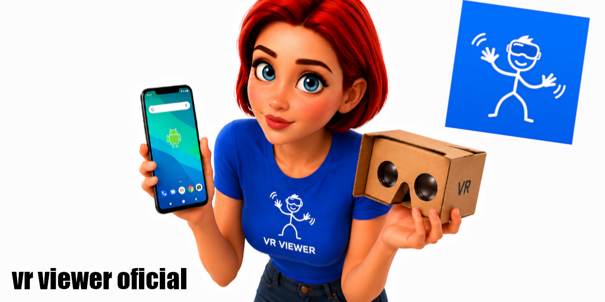

  

<h1 align="center">VR Viewer APK</h1>

  <strong>Realidad Virtual sin límites, directo desde tu smartphone</strong>

  
  
  
  

  
  
  
  

  <a href="#español">Español</a> · <a href="#english">English</a>

 

---

## Español

Lleva la Realidad Virtual al límite de tu smartphone — sin gafas caras, sin PC, sin límites.

### La idea

¿Por qué pagar cientos de dólares por unas Meta Quest cuando ya tienes una computadora en el bolsillo?

**VR Viewer APK** nace con un objetivo simple pero ambicioso: convertir tu smartphone en un visor de realidad virtual capaz de correr juegos de **SteamVR** de forma fluida, cómoda y 100% gratuita.

Sin curvas de aprendizaje complicadas. Sin hardware costoso. Solo tu celular, un visor cardboard (o similar) y ganas de jugar.

### Objetivos del proyecto

| Objetivo | Descripción |
|---|---|
| **Accesibilidad total** | Que cualquier persona con un smartphone pueda jugar VR, sin importar su presupuesto. |
| **Compatibilidad con SteamVR** | Juega tus títulos favoritos de Steam directamente desde el celular. |
| **Rendimiento optimizado** | La mayor fluidez y comodidad posible dentro de las limitaciones del hardware móvil. |
| **Gratis y de código abierto** | Sin suscripciones, sin letra pequeña. |
| **Tienda de juegos integrada** | Un espacio donde desarrolladores publiquen y usuarios descarguen juegos hechos para la app, sin PC — como Meta Quest y otros visores standalone. |

### Estado actual

**Fase temprana de desarrollo.**

Ya existe una primera versión funcional (APK), pero hay muchos detalles por pulir: rendimiento, latencia, compatibilidad de dispositivos, interfaz de usuario, y como objetivo a futuro, la tienda de juegos, para poder mandar y probar juegos sin necesidad de PC.

Es un proyecto hecho con esfuerzo personal. Si te gusta la idea, cualquier tipo de ayuda o feedback es bienvenida.

### Roadmap

- [ ] Optimizar el streaming/renderizado para reducir latencia
- [ ] Mejorar la comodidad visual (distorsión de lente, FOV, etc.)
- [ ] Ampliar compatibilidad con más modelos de smartphones
- [ ] Implementar la tienda interna de juegos standalone
- [ ] Documentación para desarrolladores que quieran publicar juegos en la app
- [ ] Soporte para más títulos de SteamVR

### Instalación

1. Descarga el APK desde la sección de **Releases**.
2. Habilita **"Fuentes desconocidas"** en tu Android.
3. Instala y sigue las instrucciones dentro de la app.

Requisitos y guía detallada de configuración: *próximamente*.

### Contribuir

  

¿Programador, diseñador, tester o simplemente entusiasta de la VR? Toda ayuda suma:

| Recurso | Enlace |
|---|---|
| APK code | [vrviewerapk.git](https://github.com/adrianortizvcv32/vrviewerapk.git) |
| ios ipa code |  |
| Driver | [MiDriverVR.git](https://github.com/adrianortizvcv32/MiDriverVR.git) |

- Reporta bugs o problemas de rendimiento en **Issues**.
- Sugiere mejoras o nuevas funciones.
- Si quieres desarrollar juegos para la futura tienda, mantente atento a la documentación.

### Apóyalo

  

Si te gusta la idea de democratizar la realidad virtual, dale una estrella al repo — ayuda a que más gente lo descubra y el proyecto pueda crecer.

  

Hecho con la meta de que la VR deje de ser un lujo y se convierta en algo al alcance de todos.

<a href="#vr-viewer-apk">Volver arriba / Cambiar idioma</a>

---

## English

Push Virtual Reality to the limit of your smartphone — no expensive headsets, no PC, no limits.

### The idea

Why pay hundreds of dollars for a Meta Quest when you already have a computer in your pocket?

**VR Viewer APK** was born with a simple but ambitious goal: turn your smartphone into a virtual reality headset capable of running **SteamVR** games smoothly, comfortably, and 100% free.

No complicated learning curves. No expensive hardware. Just your phone, a cardboard viewer (or similar), and the will to play.

### Project goals

| Goal | Description |
|---|---|
| **Total accessibility** | So anyone with a smartphone can play VR, regardless of their budget. |
| **SteamVR compatibility** | Play your favorite Steam titles directly from your phone. |
| **Optimized performance** | The best possible smoothness and comfort within mobile hardware limits. |
| **Free and open source** | No subscriptions, no fine print. |
| **Built-in game store** | A space where developers can publish and users can download games made for the app, no PC required — like Meta Quest and other standalone headsets. |

### Current status

**Early development stage.**

A first working version (APK) already exists, but there are many details left to polish: performance, latency, device compatibility, user interface, and, as a future goal, building the game store so developers can submit and test games without needing a PC.

This is a project built through personal effort. If you like the idea, any kind of help or feedback is welcome.

### Roadmap

- [ ] Optimize streaming/rendering to reduce latency
- [ ] Improve visual comfort (lens distortion, FOV, etc.)
- [ ] Expand compatibility with more smartphone models
- [ ] Implement the internal standalone game store
- [ ] Documentation for developers who want to publish games on the app
- [ ] Support for more SteamVR titles

### Installation

1. Download the APK from the **Releases** section.
2. Enable **"Unknown sources"** on your Android device.
3. Install and follow the instructions inside the app.

Detailed requirements and setup guide: *coming soon*.

### Contributing

  

Developer, designer, tester, or just a VR enthusiast? All help counts:

| Resource | Link |
|---|---|
| APK code | [vrviewerapk.git](https://github.com/adrianortizvcv32/vrviewerapk.git) |
| Driver | [MiDriverVR.git](https://github.com/adrianortizvcv32/MiDriverVR.git) |

- Report bugs or performance issues in **Issues**.
- Suggest improvements or new features.
- If you want to develop games for the future store, keep an eye out for the documentation.

### Support the project

  

If you like the idea of democratizing virtual reality, star the repo — it helps more people discover it and lets the project grow.

  

Built with the goal of making VR stop being a luxury and become something everyone can access.

<a href="#vr-viewer-apk">Back to top / Change language</a>

